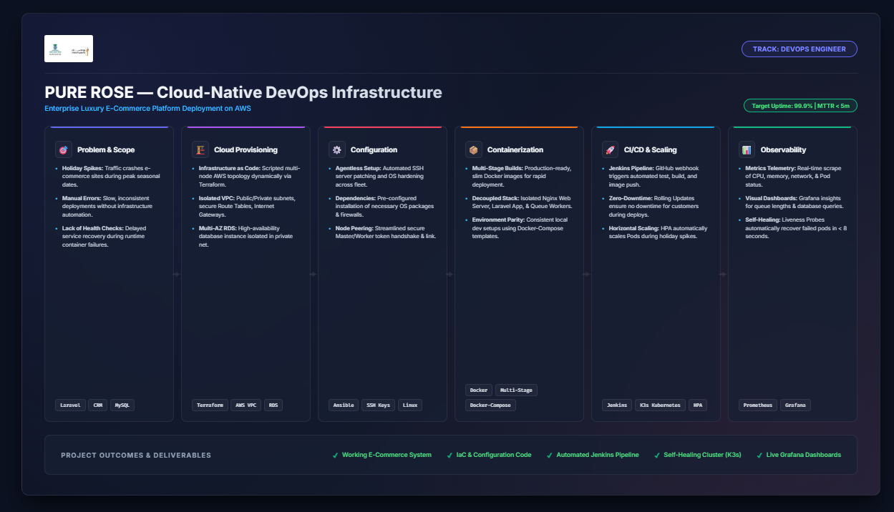

# PURE ROSE: Luxury E-Commerce Cloud-Native & Automated DevOps Platform

> 🎓 Graduation Project · Digital Egypt Pioneers Initiative (DEPI)
> <div align="center">
  <br />
  <a href="https://git.io/typing-svg">
    
  </a>
  <br />
  <p><i>An enterprise-grade, highly available, and auto-scaling cloud infrastructure built on AWS, provisioned via Terraform, configured by Ansible, containerized with Docker, automated via Jenkins, and orchestrated by Kubernetes.</i></p>

---
</div>

## 🛠️ Core Tech Stack 

<div align="center">
  <table border="0">
    <tr>
      <td align="center" width="110">
        
        <br /><b>AWS</b>
      </td>
      <td align="center" width="110">
        
        <br /><b>Terraform</b>
      </td>
      <td align="center" width="110">
        
        <br /><b>Ansible</b>
      </td>
      <td align="center" width="110">
        
        <br /><b>Docker</b>
      </td>
      <td align="center" width="110">
        
        <br /><b>Kubernetes</b>
      </td>
      <td align="center" width="110">
        
        <br /><b>Jenkins</b>
      </td>
      <td align="center" width="110">
        
        <br /><b>Prometheus</b>
      </td>
      <td align="center" width="110">
        
        <br /><b>Grafana</b>
      </td>
    </tr>
  </table>
</div>

---

## 📐 DEPI DevOps Infrastructure & Architecture Roadmap

<div align="center">
  
  <p><i>Figure 1.0: End-to-End Automated DevOps Pipeline & Cloud Infrastructure Architecture for PURE ROSE Platform.</i></p>
</div>

---

## 💻 About The Project

**PURE ROSE** is an enterprise-grade luxury e-commerce platform built on Laravel, designed with high availability at its core. To survive critical seasonal traffic spikes and ensure continuous service, we deployed a highly resilient cloud infrastructure on AWS. 

By leveraging automated provisioning, continuous delivery pipelines, and dynamic container orchestration, the system achieves **99.9% uptime** and full **self-healing** capabilities.


## 🛠️ Our DevOps Engineering Tracks

The architecture is systematically divided into distinct, automated operational phases to manage development, infrastructure, and monitoring seamlessly:

| Phase / Track | Stack Icon | Core Implementation & Engineering Highlights |
| :--- | :---: | :--- |
| **1️⃣ Infrastructure as Code** |  | **Declarative Provisioning (Terraform):**<br>• Fully automated AWS cloud network build out.<br>• Generates isolated **Virtual Private Clouds (VPC)**, Internet Gateways, Public/Private Subnets, and secure Route Tables.<br>• Provisions high-availability multi-node EC2 clusters and a dynamic, isolated Multi-AZ RDS database instance. |
| **2️⃣ Configuration Automation** |  | **Agentless System Configuration (Ansible):**<br>• Automates security hardening, OS updates, and dependency management over secure SSH.<br>• Dynamically manages credentials and config files across the fleet.<br>• Provisions K3s clusters by automating node peering handshakes between the Master and Worker nodes. |
| **3️⃣ Containerization Strategy** |  | **Optimized Multi-Stage Container Isolation (Docker):**<br>• Decouples services into micro-units (Nginx, Laravel App, and Queue Workers).<br>• Implements **Multi-Stage Builds** to produce slim, highly optimized production images—reducing storage footprint and deployment times.<br>• Includes dynamic Docker-Compose local dev setups. |
| **4️⃣ Cluster Orchestration** |  | **High Availability & Scale (K3s Kubernetes):**<br>• Coordinates workload distribution and traffic routing across AWS nodes.<br>• Dynamically adjusts workloads with Horizontal Pod Autoscaling (HPA) to meet holiday shopping spikes.<br>• Enforces continuous resilience via automated Readiness & Liveness health checks. |
| **5️⃣ Continuous Delivery** |  | **Continuous Integration & Zero-Touch Deploy (Jenkins):**<br>• Connects GitHub webhooks directly to Jenkins pipelines to automate build triggers on push.<br>• Standardizes execution steps: code checkout, security scans, unit tests, image registry upload, and rolling updates with **zero user disruption**. |
| **6️⃣ Observability & Analytics** |  | **Deep Metrics & System Visibility (Prometheus & Grafana):**<br>• Pulls node metrics, container statistics, and response codes dynamically.<br>• Centralizes system logs and performance visualization via interactive Grafana Dashboards.<br>• Sends instant notifications on resource alerts or query bottlenecks. |

---

## 🔗 Infrastructure Tech Stack Reference

| Component / Layer | Technology Used | Primary Responsibility |
| :--- | :--- | :--- |
| **Cloud Hosting** | `AWS (EC2 & RDS)` | Infrastructure virtualization, secure compute, and managed database |
| **Infrastructure as Code** | `Terraform` | Multi-node environment provisioning and networking layout |
| **Configuration Engine** | `Ansible` | Host server patching, dependency installs, and secure key distribution |
| **Containerization** | `Docker & Docker-Compose` | Standardized environment isolation and multi-stage image building |
| **CI/CD Automation** | `Jenkins` | Automated tests execution, Docker builds, and deployment triggering |
| **Orchestration** | `K3s (Kubernetes v1.36)` | Service self-healing, scaling, rolling updates, and internal networking |
| **Observability** | `Prometheus & Grafana` | Infrastructure performance telemetry and metrics visualization dashboards |

---

## 💎 Key Proof of Concept: Zero-Downtime Self-Healing

The PURE ROSE Kubernetes cluster natively guarantees high availability. When a critical container experiences an unexpected failure, the replication controller replaces it instantly without manual intervention.

```bash
# 1. Inspect running application workloads in the monitoring namespace
sudo kubectl get pods -n depi-monitoring

# NAMESPACE          NAME                               READY   STATUS    RESTARTS   AGE
# depi-monitoring    grafana-6fc5c7cb8d-vbngf           1/1     Running   0          3d4h

# 2. Simulate an unexpected container crash (Force Delete Pod)
sudo kubectl delete pod grafana-6fc5c7cb8d-vbngf -n depi-monitoring

# 3. Verify Kubernetes instantly spawns a healthy replacement Pod
sudo kubectl get pods -n depi-monitoring

# NAME                               READY   STATUS    RESTARTS   AGE
# grafana-6fc5c7cb8d-fwd6g           1/1     Running   0          8s

```

*The cluster automatically healed the monitoring stack by launching a healthy container in just **8 seconds**, completely preventing application downtime!*

---

## 🚀 Quick Start & Deployment Commands

### Prerequisites

* Docker and Docker-Compose installed locally.
* AWS account credentials and Terraform CLI.
* SSH Private Keys matching the AWS instances.

```bash
# 1. Spin up the local environment using Docker Compose (for testing)
docker-compose up -d --build

# 2. Provision cloud infrastructure
cd terraform/
terraform init && terraform apply -auto-approve

# 3. Secure and configure server nodes
cd ../ansible/
ansible-playbook -i hosts site.yml

# 4. Establish Secure SSH Connection to AWS Master Node
ssh -i yusef_new_key ec2-user@98.80.188.75

# 5. Get all running services, controllers, and pods
sudo kubectl get pods,svc -A

```

